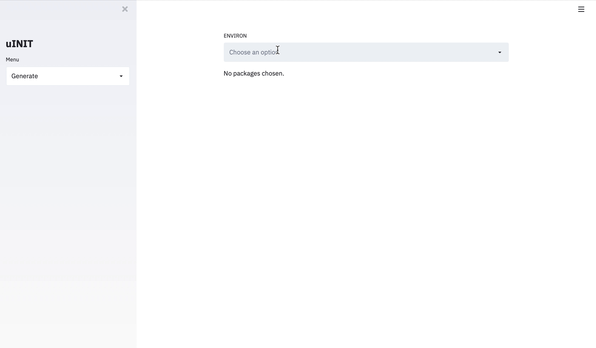

# uINIT
With uINIT, you can create Ubuntu initialization script in a snap, instead of manually install separate packages with commands line by line.

## Usage
Select the needed packages, and click "Download shell script". The selection box also supports text input, so you can also search packages by typing its name.  

## Contribute to this project
Write package installation scripts following `sh/template.sh`, and make a pull request.
